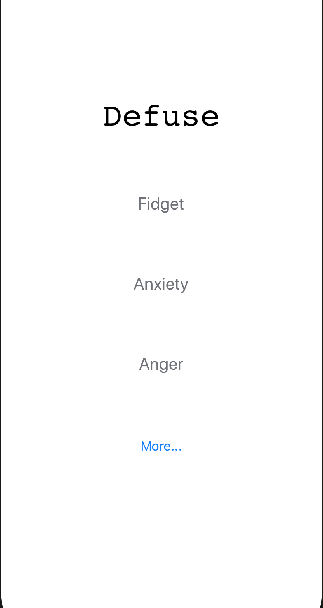
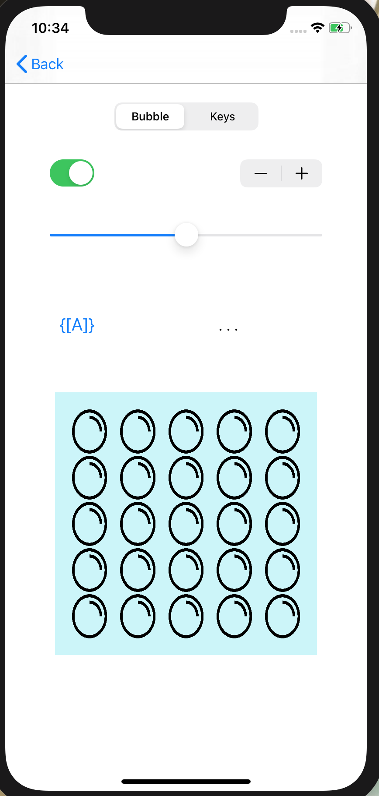
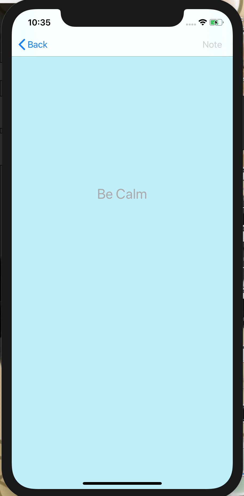

# App Name: Defuse
 Purpose: Help people defuse excess enegry or negative emtions:
- Fidgeting
- Anxiety
- Anger
- Depression
etc.

## Description
A simple app with that has a user firendly menu that allows one to choose the tool to help them with what they're dealing with emotionally for that moment. 
!IMPORTANT! This is not meant as an actual fix to problems, only to help an individual calm down and relax.

Views
---
  

### For the User

Simple Menu Start Screen where you choose between the Options available
- Fidget has Multiple Buttons with which the user can interact with
- Anger and Anxiety go slowly through colors that can help with the emtions in question and play soft music to help.

### How to Install the App
> *Currently not on the App Store*

> * Can Download from Creators Computer if asked*

###### GitHub
[Repository](https://github.com/KitsuneNoctus/Defuse-App-HC)

